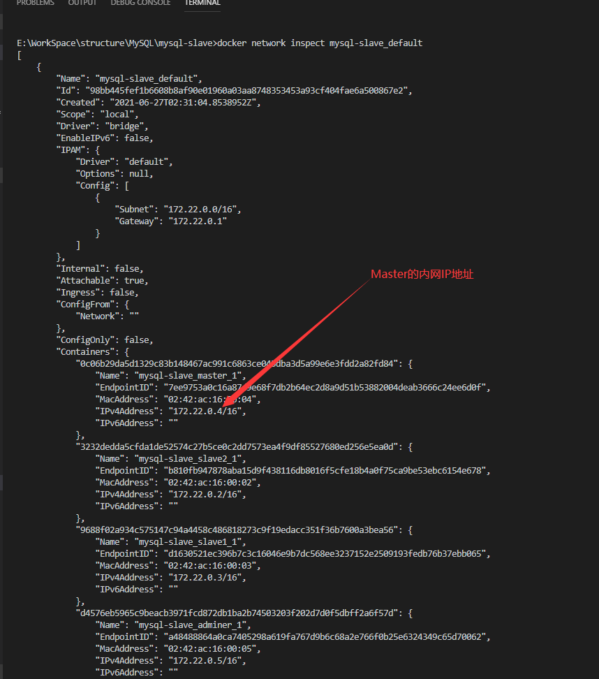
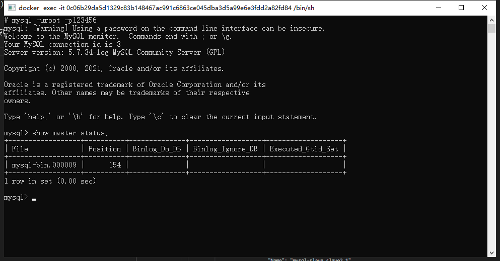
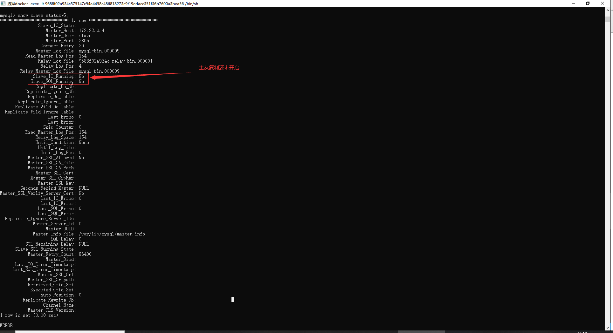
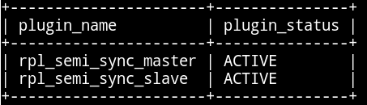
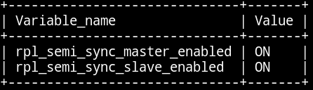

# 主从数据库配置

## 1. 为什么基于Docker搭建？
* 资源有限
* 虚拟机搭建对机器配置有要求，并且安装mysql步骤繁琐
* 一台机器上可以运行多个Docker容器
* Docker容器之间相互独立，有独立ip，互不冲突
* Docker使用步骤简便，启动容器在秒级别

## 2. 利用Docker搭建主从服务器
首先拉取docker镜像,我们这里使用5.7版本的mysql：
```
docker pull mysql:5.7
```
## 3. 主从配置【一对一】 1个Master，1个Slave
### 3.1 容器准备
以下配置修改后均需重启对应容器
#### 3.1.1. 配置docker-compose.yml
```
version: '3'
services:
  adminer:              # 数据库管理客户端，链接master，方便操作可忽略
    image: adminer
    restart: always
    ports:
      - 8080:8080
    links:
      - master:db

  master:
    image: mysql:5.7
    command: --default-authentication-plugin=mysql_native_password # 使用adminer需配置此项
    restart: always
    environment:
      MYSQL_ROOT_PASSWORD: 123456
    volumes:
      - ./config/master/conf:/etc/mysql/conf.d
      - ./config/master/logs:/var/log/mysql
      - ./config/master/data:/var/lib/mysql

  slave1:
    image: mysql:5.7
    command: --default-authentication-plugin=mysql_native_password
    restart: always
    environment:
      MYSQL_ROOT_PASSWORD: 123456
    volumes:
      - ./config/slave1/conf:/etc/mysql/conf.d
      - ./config/slave1/logs:/var/log/mysql
      - ./config/slave1/data:/var/lib/mysql
  
  # 多Slave从库时开启
  # slave2:
  #   image: mysql:5.7
  #   command: --default-authentication-plugin=mysql_native_password
  #   restart: always
  #   environment:
  #     MYSQL_ROOT_PASSWORD: 123456
  #   volumes:
  #     - ./config/slave2/conf:/etc/mysql/conf.d
  #     - ./config/slave2/logs:/var/log/mysql
  #     - ./config/slave2/data:/var/lib/mysql

```

#### 3.1.2. 数据库配置
##### 主数据库 Master
```
# ./config/master/conf/my.cnf
[mysqld]
# code...
# 唯一标识，内网唯一
server_id = 1    

# 开启二进制日志功能，可以随便取（关键）
log_bin = mysql-bin         

# 日志记录的格式类型
binlog_format=STATEMENT     
# code...
```
##### 从数据库 Slave
```
# ./config/slave{n}/conf/my.cnf
[mysqld]
# code...
# 唯一标识，内网唯一
server_id = m

# 开启二进制日志功能，以备Slave作为其它Slave的Master时使用
log-bin=mysql-slave-bin

# 日志记录的格式类型
binlog_format=STATEMENT 

# relay_log配置中继日志
relay_log=edu-mysql-relay-bin

# code...
```

#### 3.1.3. 启动容器
```
# ./
docker-compose up -d
```

### 3.2. 链接Master（主）和Slave（从）
#### 3.2.1. Master操作
##### 查看Master内网IP
```
# mysql-slave_app为network名称，可使用docker network ls查看
docker network inspect mysql-slave_app
```
当前为`172.22.0.4`


##### Master状态信息
在Master进入mysql，执行`show master status`，获取File和Position（Slave链接到Master的关键信息）
当前为`File=mysql-bin.000009`，`Position=154`


##### 创建Slave用户
在Master中执行以下SQL，创建mysql新用户，作为Slave链接Master的账号
```
CREATE USER 'slave'@'%' IDENTIFIED BY '123456';
GRANT REPLICATION SLAVE, REPLICATION CLIENT ON *.* TO 'slave'@'%';
flush privileges;
```

#### 3.2.2. Slave操作
##### 配置主从链接
在Slave进入mysql，执行
```
# 如果之前已经执行过了，重置命令 reset slave
# 以下参数分别对应上述步骤获得的信息
change master to \
master_host='172.22.0.4',\
master_user='slave',\
master_password='123456',\
master_port=3306,\
master_log_file='mysql-bin.000009', \
master_log_pos=154,\
master_connect_retry=30;
```
命令说明：

* master_host ：Master的地址，指的是容器的独立ip,可以通过docker inspect --format='{{.NetworkSettings.IPAddress}}' 容器名称|容器id查询容器的ip
* master_port：Master的端口号，指的是容器的端口号
* master_user：用于数据同步的用户
* master_password：用于同步的用户的密码
* master_log_file：指定 Slave 从哪个日志文件开始复制数据，即上文中提到的 File 字段的值
* master_log_pos：从哪个 Position 开始读，即上文中提到的 Position 字段的值
* master_connect_retry：如果连接失败，重试的时间间隔，单位是秒，默认是60秒

##### 开启主从复制
在Slave 中的mysql终端执行`show slave status \G;`用于查看主从同步状态。

开启主从同步，执行`start slave`
再次执行`show slave status \G;`
```
# code...
Slave_IO_Running: Yes 
Slave_SQL_Running: Yes
# code...
```
即表示链接成功

一些常用命令
```
# 开启
start slave

# 关闭
stop slave

# 重置 需先stop slave
reset slave
```

#### 4. 主从配置【一对多】 1个Master，n个Slave
| 需保证已完成【一对一】，并且正常运行中
##### 4.1. 添加slave2容器
在docker-compose.yml 中添加slave2容器并启动
```
# slave2配置与slave1类似
docker-compose up -d slave2
```
##### 4.2. 保证与Master数据一致
拷贝Master主数据库数据到Slave2，即需要相同的*初态*，当前默认Master之新增了一个db1数据库
```
# 在Master进入mysql 导出数据
mysqldump  -uroot -p123456  db1  >  /root/db1.sql

# 在Slave2进入mysql 导入db1.sql数据
create database db1;
use db1;
source  /root/db1.sql;
```

##### 4.3. 链接Master
查看最新的Position信息
在Master进入mysql，执行`show master status;`
在Slave2进入mysql，指定Master主数据库信息
```
change master to \
master_host='172.22.0.4',\
master_user='slave',\
master_password='123456',\
master_port=3306,\
master_log_file='mysql-bin.000009', \
master_log_pos=677,\
master_connect_retry=30;
```

##### 开启Slave2
在Slave2进入mysql
```
start slave;
```
使用`show slave  status\G;`查看状态，同【一对一】

#### 5. 主主配置【主-主】
提示即双向【一对一】配置

#### 6. 主从复制排错
使用start slave开启主从复制过程后，如果SlaveIORunning一直是Connecting，则说明主从复制一直处于连接状态，这种情况一般是下面几种原因造成的，我们可以根据 Last_IO_Error提示予以排除。

* 网络不通：检查ip,端口
* 密码不对：检查是否创建用于同步的用户和用户密码是否正确
* pos不对：检查Master的 Position

#### 7. 测试主从复制
测试主从复制方式就十分多了，最简单的是在Master创建一个数据库，然后检查Slave是否存在此数据库。


#### 8. 主从同步数据复制模式
##### 8.1. 复制模式介绍

* 异步复制( Asynchronous replication )
– 主库在执行完客户端提交的事务后会立即将结果返给客户端,并不关心从库是否已经接收并处理。
* 全同步复制( Fully synchronous replication )
– 当主库执行完一个事务,所有的从库都执行了该事务才返回给客户端。
* 半同步复制( Semisynchronous replication )
– 介于异步复制和全同步复制之间,主库在执行完客户端提交的事务后不是立刻返回给客户端,而是等待至少一个从库接收到并写到 relay log 中才返回给客户端

##### 8.2. 配置半同步复制模式

*a. 查看当前的数据库服务器是否支持动态加载模块*

```
mysql> show variables  like  'have_dynamic_loading';
```
如下图表示支持


*b. 安装半同步复制的模块*

Master中
```
mysql> install plugin  rpl_semi_sync_master  soname  'semisync_master.so';
```

Slave中
```
mysql> install plugin  rpl_semi_sync_master  soname  'semisync_master.so';
```

*c. 查看模块状态*
```
mysql> select plugin_name,plugin_status from information_schema.plugins where plugin_name like '%semi%';
```

*d. 启用半同步复制——在安装完插件后，半同步复制默认是关闭的*
```
主：mysql> set global  rpl_semi_sync_master_enabled = 1;
从：mysql> set global rpl_semi_sync_slave_enabled = 1;
```

*e. 查看是否启用成功*

```
mysql> show  variables like 'rpl_semi_sync_%_enabled';
```

*f. 把配置写进配置文件使其永久生效*

– 命令配置临时配置,重启服务会失效

– 修改后需要重启服务

– 写在主配置文件 {container_folder}/my.cnf 的 [mysqld] 下方(需重启对应容器)

```
# vim {container_folder}/my.cnf
plugin-load = "rpl_semi_sync_master=semisync_master.so;
rpl_semi_sync_slave=semisy	nc_slave.so"   //安装模块
rpl-semi-sync-master-enabled = 1  //启用半同步复制
rpl-semi-sync-slave-enabled = 1	

# systemctl restart mysqld
```

*g. 查看模块状态*

```
mysql> select plugin_name,plugin_status from information_schema.plugins  where  plugin_name like '%semi%';
```


*h. 查看是否启用成功*

```
mysql> show variables like "rpl_semi_sync_%_enabled";
```

