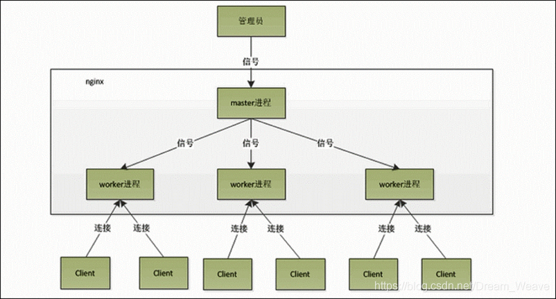

##  Nginx
###  Nginx详解
 Nginx——Ngine X，是一款自由的、开源的、高性能HTTP服务器和反向代理服务器；也是一个IMAP、POP3、SMTP代理服务器；也就是说 Nginx本身就可以托管网站（类似于Tomcat一样），进行Http服务处理，也可以作为反向代理服务器使用。

 Nginx 解决了服务器的C10K（就是在一秒之内连接客户端的数目为10k即1万）问题。它的设计不像传统的服务器那样使用线程处理请求，而是一个更加高级的机制—事件驱动机制，是一种异步事件驱动结构。

虽然目前 Nginx的份额在市场上只占很少部分，但是其高性能和低消耗内存的结构，使得其越来越普遍，典型的一个应用就是我们可以使用 Nginx作为反向代理进行网站的负载均衡器。例如：Wordpress、GitHub等知名的网站都使用到了 Nginx。

*特点*
* 跨平台：可以在大多数Unix like 系统编译运行。而且也有Windows的移植版本。 
* 配置异常简单：非常的简单，易上手。 
* 非阻塞、高并发连接：数据复制时，磁盘I/O的第一阶段是非阻塞的。官方测试能支持5万并发连接，实际生产中能跑2~3万并发连接数（得益于 Nginx采用了最新的epoll事件处理模型（消息队列）。 
*  Nginx代理和后端Web服务器间无需长连接； 
*  Nginx接收用户请求是异步的，即先将用户请求全部接收下来，再一次性发送到后端Web服务器，极大减轻后端Web服务器的压力。 
* 发送响应报文时，是边接收来自后端Web服务器的数据，边发送给客户端。 
* 网络依赖性低，理论上只要能够ping通就可以实施负载均衡，而且可以有效区分内网、外网流量。 
* 支持内置服务器检测。 Nginx能够根据应用服务器处理页面返回的状态码、超时信息等检测服务器是否出现故障，并及时返回错误的请求重新提交到其它节点上。 
* 采用Master/worker多进程工作模式 
* 此外还有内存消耗小、成本低廉（比F5硬件负载均衡器廉价太多）、节省带宽、稳定性高等特点。

###  Nginx机制
#### 基本功能

 Nginx的功能包括基本HTTP功能和扩展功能。和Apache服务器一样， Nginx服务器为了提供更多的功能并且能够有效地扩展这些功能。每一个模块都提供了一个功能，通过编译这些功能模块来实现功能的扩展。

##### 1、基本HTTP功能

* 提供静态文件和index文件，处理静态文件，索引文件以及自动索引，打开文件描述符缓存；
* 使用缓存加速反向代理，反向代理加速（无缓存），简单的负载均衡和容错；
* 使用缓存机制加速远程FastCGI，简单的负载均衡和容错；
* 模块化的结构。过滤器包括gzipping,byte ranges,chunked responses，以及 SSI-filter。在SSI过滤器中，到同一个 proxy 或者 FastCGI 的多个子请求并发处理；
* 支持SSL 和 TLS SNI 支持；
* IMAP/POP3代理服务功能；
* 使用外部 HTTP 认证服务器重定向用户到 IMAP/POP3 后端；
* 使用外部 HTTP 认证服务器认证用户后连接重定向到内部的 SMTP 后端。

##### 2、其他HTTP功能

* 基于名称和基于IP的虚拟服务器；
* 支持Keep-alive和管道连接；
* 灵活的配置和重新配置、在线升级的时候不用中断客户访问的处理；
* 访问日志的格式，缓存日志写入和快速日志轮循；
* 3xx-5xx错误代码重定向；
* 速度限制

#### 基本模块
 Nginx的核心模块包括内核模块和事件驱动模块，即：CoreModule和EventsModule；另外还有第三方模块 HTTP内核模块，HttpCoreModule，它是 Nginx服务器的核心模块。

CoreModule和EventsModule模块的配置相对于HttpCoreModule会少一些，但是它们的配置将会影响系统的性能，而非功能上的差异。

* CoreModule用于控制 Nginx服务器的基本功能； 
* EventsModule用于控制 Nginx如何处理连接。该模块的指令的一些参数会对应用系统的性能产生重要的影响； 
* HttpCoreModule提供HTTP访问 Nginx服务器，该模块是不能缺少的。

#### 进程模型
 Nginx采用的是多进程单线程和多路IO复用模型

##### 多进程单线程模型

 Nginx 自己实现了对epoll的封装，是多进程单线程的典型代表。使用多进程模式，不仅能提高并发率，而且进程之间是相互独立的，一 个worker进程挂了不会影响到其他worker进程。

master进程管理worker进程：

* 接收来自外界的信号。
* 向各worker进程发送信号。
* 监控woker进程的运行状态。
* 当woker进程退出后（异常情况下），会自动重新启动新的woker进程。

注意worker进程数，一般会设置成机器cpu核数。因为更多的worker只会导致进程之间相互竞争cpu，从而带来不必要的上下文切换。

当一个 worker 进程在 accept() 这个连接之后，就开始读取请求，解析请求，处理请求，产生数据后，再返回给客户端，最后才断开连接，一个完整的请求。一个请求，完全由worker进程来处理，而且只会在一个worker进程中处理。优点：

* 节省锁带来的开销。每个worker进程都彼此独立地工作，不共享任何资源，因此不需要锁。同时在编程以及问题排查上时，也会方便很多。
* 独立进程，减少风险。采用独立的进程，可以让互相之间不会影响，一个进程退出后，其它进程还在工作，服务不会中断，master进程则很快重新启动新的worker进程。当然，worker进程自己也能发生意外退出。

##### IO多路复用模型epoll
多路复用，允许我们只在事件发生时才将控制返回给程序，而其他时候内核都挂起进程，随时待命。

epoll通过在Linux内核中申请一个简易的文件系统（文件系统一般用B+树数据结构来实现），其工作流程分为三部分：

* 调用 int epoll_create(int size)建立一个epoll对象，内核会创建一个eventpoll结构体，用于存放通过epoll_ctl()向epoll对象中添加进来的事件，这些事件都会挂载在红黑树中。
* 调用 int epoll_ctl(int epfd, int op, int fd, struct epoll_event *event) 在 epoll 对象中为 fd 注册事件，所有添加到epoll中的事件都会与设备驱动程序建立回调关系，也就是说，当相应的事件发生时会调用这个sockfd的回调方法，将sockfd添加到eventpoll 中的双链表。
* 调用 int epoll_wait(int epfd, struct epoll_event * events, int maxevents, int timeout) 来等待事件的发生，timeout 为 -1 时，该调用会阻塞直到有事件发生。

注册好事件之后，只要有fd上事件发生，epoll_wait()就能检测到并返回给用户，用户执行阻塞函数时就不会发生阻塞了。
