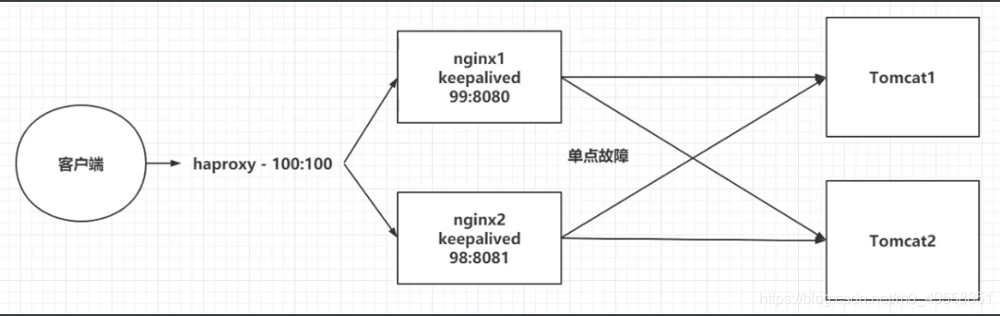

# Nginx集群
## 概念
### 集群（Cluster）
计算机集群简称集群，是一种计算机系统，它通过一组松散集成的计算机软件(和/或)硬件连接起来高度紧密地协作完成计算工作。在某种意义上，他们可以被看作是一台计算机。集群系统中的单个计算机通常称为节点，通常通过局域网连接，但也有其它的可能连接方式。集群计算机通常用来改进单个计算机的计算速度(和/或)可靠性。一般情况下集群计算机比单个计算机，工作站或超级计算机性能价格比要高得多。

集群就是一组相互独立的计算机，通过高速的网络组成一个计算机系统，每个集群节点都是运行其自己进程的一个独立服务器。对网络用户来讲，网站后端就是一个单一的系统，协同起来向用户提供系统资源，系统服务。通过网络连接组合成一个组合来共同完一个任务。

### 集群的分类

* 负载均衡集群（Load Balancing clusters），简称LBC或LB
    - 负载均衡集群为了提供更为实用，性价比更高的系统架构解决方案，可以把很多客户集中的访问请求尽可能平均分摊在计算机集群中处理。
* 高可用性集群（High-Availability clusters），简称HAC
    - 在集群任意一个节点失效的情况下，该节点的所有任务会自动转移到其他正常的节点上，并且不影响真个集群的运行。
* 高性能计算集群（High-performance clusters），简称HPC
    - 通常高性能计算集群设置为集群开发的并行应用程序，以解决负复杂的科学问题（天气预报，石油勘探，核反应模拟等）

### 常用集群软硬件

* 常用开源集群软件有：lvs，keepalived，haproxy，nginx，apache，heartbeat
* 常用商业集群硬件有：F5,Netscaler，Radware，A10 等……

## Nginx集群搭建
| 注意集群主机间防火墙问题，由于docker环境无需配置，所以容易忽略

* 单点故障，避免nginx的宕机，导致整个程序的崩溃
* 准备多台Nginx
* 准备keepalived，监听nginx的健康情况
* 准备haproxy，提供一个虚拟的路径，统一的去接收用户的请求，进行负载均衡

### 准备
