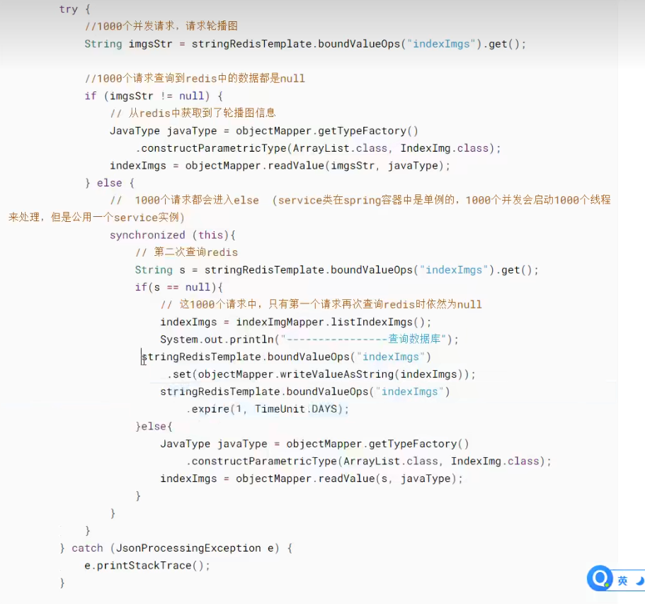
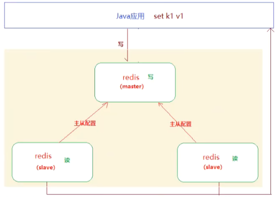
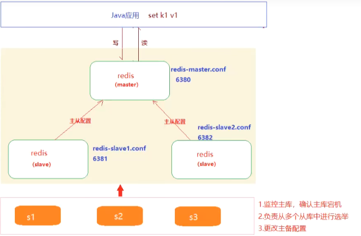

# Redis学习

## 一、什么是Reids

### 1. 简介

Redis 是由 Salvatore Sanfilippo 用C语言开发的一款开源的、高性能的键值对存储数据库，它采用 BSD 协议，为了适应不同场景下的存储需求，提供了多种键值数据类型。

到目前为止，Redis 支持的键值数据类型有字符串、列表、有序集合、散列及集合等。正是因为它有如此丰富的数据类型的支持，才会有庞大的用户群体。

Redis 内置复制、Lua 脚本、LRU 收回、事务及不同级别磁盘持久化功能，同时通过 Redis Sentinel 实现高可用，通过 Redis Cluster 提供自动分区等相关功能。

### 2. 特性

Redis 是一款功能强大、支持多种数据类型的数据库，它具有许多优秀的特性，具体如下。

1) 支持多种计算机编程语言，如 Java、C、C++、Python、PHP、Lua、Ruby、Node.js、C＃、GoLand 等。
2) 具有丰富的数据类型，如 String、List、Set、Hash、Sorted Set 等。
3) 支持多种数据结构，如哈希、集合、位图（多用于活跃用户数等的统计）、HyperLogLog（超小内存唯一值计数，由于只有 12KB，因而是有一定误差范围的）、GEO（地理信息定位）。
4) 读/写速度快，性能高。官方给出的数据是，Redis 能读的速度是 110 000次/s，写的速度是 81 000次/s。之所以有这么快的读/写速度，是因为这些数据都存储在内存中。
5) 支持持久化。Redis 的持久化也就是备份数据，它每隔一段时间就将内存中的数据保存在磁盘中，在重启的时候会再次加载到内存中，从而实现数据持久化。Redis 的持久化方式是 RDB 和 AOF。
6) 简单且功能强大。如利用 Redis 可以实现消息订阅发布、Lua 脚本、数据库事务、Pipeline（管道，即当指令达到一定数量后，客户端才会执行）。同时 Redis 是单线程的，它不依赖外部库，它的所有操作都是原子性的，使用简单。
7) 实现高可用主从复制，主节点做数据副本。
8) 实现分布式集群和高可用。Redis Cluster 支持分布式，进而可以实现分布式集群；Redis Sentinel 支持高可用。

### 3. 适用场景

Redis 是一款功能强大的数据库，在实际应用中，不管是什么架构的网站或系统，我们都可以将 Redis 引入项目，这样就可以解决很多关系型数据库无法解决的问题。

比如，现有数据库处理缓慢的任务，或者在原有的基础上开发新的功能，都可以使用 Redis来完成。

接下来，我们一起来看看Redis的典型使用场景。

#### 1) 做缓存

这是 Redis 使用最多的场景，Redis 能够替代 Memcached。

使用 Redis，不需要每次都重新生成数据，而且它的缓存速度和查询速度比较快，使用也比较方便。比如，实现数据查询、缓存新闻消息内容、缓存商品内容或购物车等。

#### 2) 做计数器应用

Redis 的命令具有原子性，它提供了 INCR、DECR、GETSET、INCRBY 等相关命令来构建计数器系统。

可以使用 Redis 来记录一个热门帖子的转发数、评论数。通过 Redis 的原子递增，可以实现在任何时候封锁一个 IP 地址等。

#### 3) 实现消息队列系统

Redis 运行稳定，速度快，支持模式匹配，也可以实现消息订阅发布。

Redis 还有阻塞队列的命令，能够让一个程序在执行时被另一个程序添加到队列中。比如，实现秒杀、抢购等。#### 4) 做实时系统、消息系统

可以利用 Redis 的 set 功能做实时系统，来查看某个用户是否进行了某项操作，对其行为进行统计对比。

也可以利用 Redis 的 Pub/Sub 构建消息系统，如在线聊天系统。

#### 5) 实现排行榜应用

排行榜的实现利用了 Redis 的有序集合。比如，对上百万个用户的排名，采用其他数据库来实现是非常困难的，而利用 Redis 的 ZADD、ZREVRANGE、ZRANK 等命令可以轻松实现排名并获取排名的用户。

#### 6) 做数据过期处理

我们可以将 sorted set 的 score 值设置成过期时间的时间戳，然后通过过期时间排序，找出过期的数据进行删除。

可以采用过期属性来确认一个关键字在什么时候应该被删除。也可以利用 UNIX 时间作为关键字，将列表按时间排序。对 currenttime 和 timeto_live 进行检索，查询出过期的数据，进而删除。

#### 7) 做大型社交网络

任何架构的系统或网站都可以与 Redis 很好地结合，同样，采用 Redis 可以很好地与社交网络相结合，如新浪微博、Twitter 等。

比如，我们在使用 QQ 时，进行实时聊天就需要 Redis 的支持；又如，我们在浏览微博时，实现信息的刷新、浏览查看等也需要 Redis 的支持。

#### 8) 分布式集群架构中的 session 分离

采用分布式集群部署，可以满足一个 Web 应用系统被大规模访问的需要。而要实现分布式集群部署，就要解决 session 统一的问题。通常可以采用 Redis 来实现 session 共享机制，以达到 session 统一的目的。

## 二、Redis常见问题

> 使用redis作为缓存在高并发场景下有可能出现**缓存击穿**、**缓存穿透**、**缓存雪崩**等问题

## 1. 缓存击穿

> 大量的并发请求同时访问同一个在redis中不存在的数据，就会导致大量的请求绕过redis同时并发访问数据库，对数据库造成了高并发访问压力。

* 解决方案：使用 `双重检测锁` 解决 `缓存击穿`问题

  
* `Jmeter`测试

  > Jmeter是基于Java开发的一个测试工具，可用于并发测试
  >

## 2. 缓存穿透

> 大量的并发请求一个数据库中不存在的数据，首先在redis中无法命中，最终所有请求都会访问数据库，同样会导致数据库承受巨大的访问压力。

* 解决方案：当从数据库查询到一个null时，写一个非空的数据到redis，并设置过期时间。

## 3. 缓存雪崩

> 缓存大量的数据集中过期，导致请求这些数据的大量并发请求会同时访问数据库。

* 解决方案：
  * 将缓存中的数据设置成不同的过期时间
  * 在访问洪峰到达前缓存热点数据，过期时间设置到流量最低的时段

## 三、Redis高级应用

> 使用redis作为缓存数据库使用目的是为了提升数据加载速度、降低对数据库的访问压力、我们需要保证redis的可用性。
>
> * 主从配置
> * 哨兵模式
> * 集群配置

### 1. 主从配置

> 主从配置：在多个redis实例建立起主从关系，当主redis中的数据发生变化，从redis中的数据也会同步变化。
>
> * 通过主从配置可以实现redis数据的备份（`从redis`就是对 `主redis`的备份），保证数据的安全性
> * 通过主从配置可以实现redis的读写分离

#### 主从配置示例

* 启动三个redis实例
  配置参考 `master-slave` 目录

### 2. 哨兵模式

> 哨兵模式：用于监听主库，当确认主库宕机后，从备库（从库）中选举一个转备为主

#### 哨兵模式配置

* 首先实现三个redis实例之间的主从配置（如上）
* 创建三个哨兵，参考 `sentinel`目录

### 3. 集群配置
